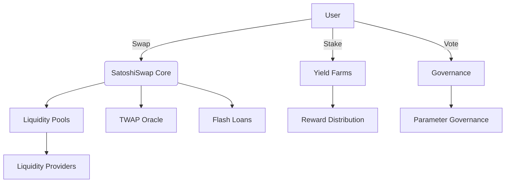

# SatoshiSwap - Advanced DeFi Protocol for Stacks

[](https://docs.hiro.so/clarinet)

SatoshiSwap is a next-generation decentralized exchange protocol built on Stacks L2, offering Bitcoin-compatible DeFi primitives with enhanced capital efficiency and advanced trading features. Designed for seamless integration with Bitcoin ecosystem assets.

## Features

- **Concentrated Liquidity Pools**  
  Optimize capital efficiency with customizable price ranges
- **TWAP Price Oracles**  
  Secure time-weighted average pricing resistant to manipulation
- **Multi-Hop Swaps**  
  Efficient cross-pool routing with optimized price execution
- **Flash Loans**  
  Non-custodial instant liquidity with atomic transactions
- **Yield Farming**  
  Stake LP tokens to earn protocol rewards
- **Governance System**  
  Community-driven protocol evolution with token-weighted voting
- **Gas-Efficient Architecture**  
  Optimized for Stacks L2 performance
- **Bitcoin Compatibility**  
  Native support for Bitcoin-derived assets

## Getting Started

### Prerequisites
- Clarinet v3.0+
- Node.js v18+
- Bitcoin testnet environment

### Installation
```bash
# Create new Clarinet project
clarinet new satoshiswap && cd satoshiswap

# Add dependencies
clarinet requirements check
clarinet requirements install
```

### Testing
```bash
# Run comprehensive test suite
clarinet test --watch
```

## Core Functionality

### Pool Creation
```clarity
(create-pool .sip10-token-x .sip10-token-y u1000000 u1000000)
```

### Add Liquidity
```clarity
(add-liquidity 
  u0 
  .sip10-token-x 
  .sip10-token-y 
  u500000 
  u500000 
  u950
)
```

### Swap Tokens
```clarity
(swap-exact-x-for-y 
  u0 
  .sip10-token-x 
  .sip10-token-y 
  u10000 
  u9900
)
```

### Flash Loan
```clarity
(flash-swap 
  u0 
  .sip10-token-x 
  .sip10-token-y 
  u1000000 
  .flash-callback-contract
)
```

## Architecture 🏛️



## Governance 

1. **Stake Governance Tokens**
```clarity
(stake-governance .gov-token u1000000 u144)
```

2. **Propose Changes**
```clarity
(propose-parameter-change "protocol-fee-rate" u75)
```

3. **Delegate Voting Power**
```clarity
(delegate-votes .delegate-address)
```

## Security

### Audit Status
```markdown
- [ ] Initial security audit
- [ ] Economic audit
- [ ] Formal verification
```

**Important:** This protocol is experimental software. Use at your own risk.

## Resources

- [Stacks Documentation](https://docs.stacks.co/)
- [Clarinet Reference](https://docs.hiro.so/clarinet)

## Contributing

We welcome contributions! Please read our [Contribution Guidelines](CONTRIBUTING.md) before submitting PRs.

